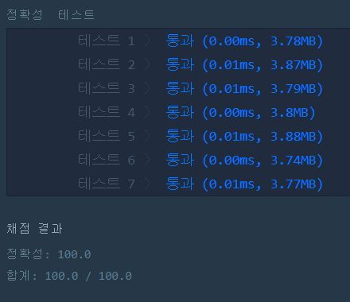

# K번째 수(Level1)
---
## 문제

- Level1. K번째 수</br>
배열 array의 i번째 숫자부터 j번째 숫자까지 자르고 정렬했을 때, k번째에 있는 수를 구하려 합니다.
배열 array, [i, j, k]를 원소로 가진 2차원 배열 commands가 매개변수로 주어질 때,
commands의 모든 원소에 대해 앞서 설명한 연산을 적용했을 때 나온 결과를 배열에 담아 return 하도록
solution 함수를 작성해주세요.
> 출처 https://programmers.co.kr/learn/courses/30/lessons/42748

## Solution
- 배열 [i,j,k]를 원소로 가진 2차원 배열의 크기를 확인하여 변수 i,j,k에 값을 대입합니다.
- i-1번째 위치에 저장된 원소부터 j-1번째 위치에 저장된 원소까지 잘라 새로운 벡터를 만듭니다.
- 만든 후, 오름차순으로 정렬을 시키고 k-1번째 위치에 있는 원소를 answer(vector)에 추가합니다.

## 정확성 테스트


### Keyword
```정렬```
