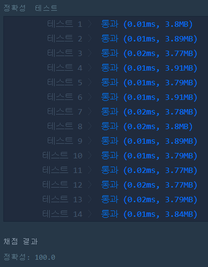

# x만큼 간격이 있는 n개의 숫자(LEVEL1)
---
## 문제
- Level1. x만큼 간격이 있는 n개의 숫자
함수 solution은 정수 x와 자연수 n을 입력 받아, x부터 시작해 x씩 증가하는 숫자를 n개 지니는 리스트를 리턴해야 합니다. 다음 제한 조건을 보고, 조건을 만족하는 함수, solution을 완성해주세요.

> 출처 https://programmers.co.kr/learn/courses/30/lessons/12954

## Solution
- ```for```문을 사용하여 값을 추가해줍니다.
- 첫번째 원소 값에는 ```x```의 값을 넣어주고, 두번째 부터 ```x + ( x * index )``` 형식으로 값을 넣어줍니다.

## 정확성 테스트 


## Keyword
```연습문제```
