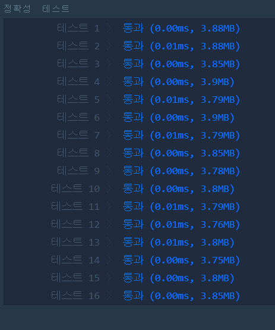

# 가운데 글자 가져오기(LEVEL1)
---
## 문제

- Level1. 가운데 글자 가져오기
단어 s의 가운데 글자를 반환하는 함수, solution을 만들어 보세요. 단어의 길이가 짝수라면 가운데 두글자를 반환하면 됩니다.
> 출처 https://programmers.co.kr/learn/courses/30/lessons/12903

## Solution
- 길이가 홀수일 경우 ```문자열 길이/2``` 위치한 인덱스의 값을 반환합니다.
- 길이가 짝수일 경우 ```(문자열 길이/2)-1``` + ```문자열 길이/2``` 위치한 인덱스 값을 반환합니다.

## 정확성 테스트


## Keyword
```연습문제```
