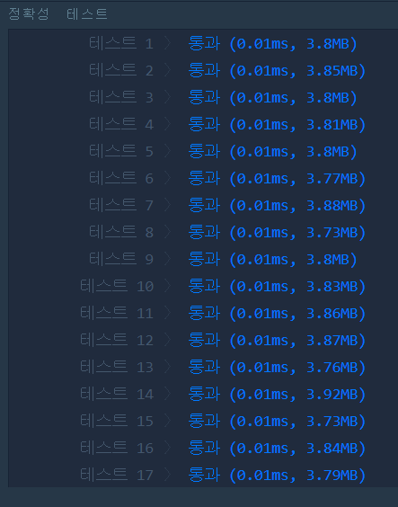
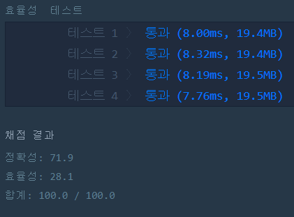

# 같은 숫자는 싫어(LEVEL1)
---
## 문제
- Level1. 같은 숫자는 싫어
배열 arr가 주어집니다. 배열 arr의 각 원소는 숫자 0부터 9까지로 이루어져 있습니다. 이때, 배열 arr에서 연속적으로 나타나는 숫자는 하나만 남기고 전부 제거하려고 합니다. 단, 제거된 후 남은 수들을 반환할 때는 배열 arr의 원소들의 순서를 유지해야 합니다.
배열 arr에서 연속적으로 나타나는 숫자는 제거하고 남은 수들을 return 하는 solution 함수를 완성해 주세요.

> 출처 https://programmers.co.kr/learn/courses/30/lessons/12906

## Solution
- 먼저, 첫번째 원소는 ```answer``` 벡터에 추가합니다.
- 두번째 원소부터 ```자신의 위치 -1``` 인덱스와 비교하여 같지 않을 경우 ```answer``` 벡터에 값을 추가합니다.

## 정확성, 효율성 테스트



## Keyword
```연습문제```
