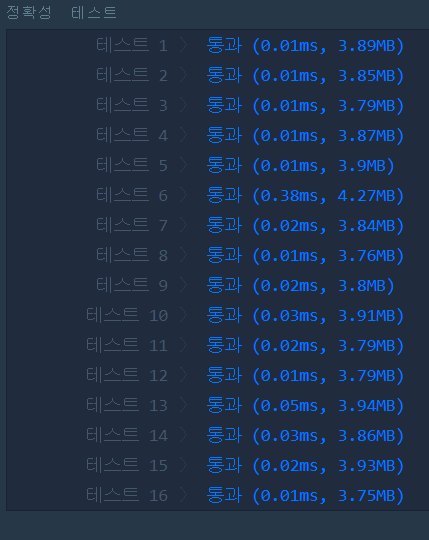

## 나누어 떨어지는 숫자 배열(LEVEL1)
---
### 문제
- Level1. 나누어 떨어지는 숫자 배열
array의 각 element 중 divisor로 나누어 떨어지는 값을 오름차순으로 정렬한 배열을 반환하는 함수, solution을 작성해주세요.
divisor로 나누어 떨어지는 element가 하나도 없다면 배열에 -1을 담아 반환하세요.

> 출처 https://programmers.co.kr/learn/courses/30/lessons/12910

### Solution
- 벡터를 순차 검색하여 divisor로 나누어 떨어지면 ```answer``` 벡터에 값을 추가합니다.
- 벡터가 비어있을경우 ```-1```을 삽입합니다.
- 값을 다 삽입 한 후, 오름차순으로 정렬합니다.

### 정확성 테스트


### Keyword
```연습문제```
