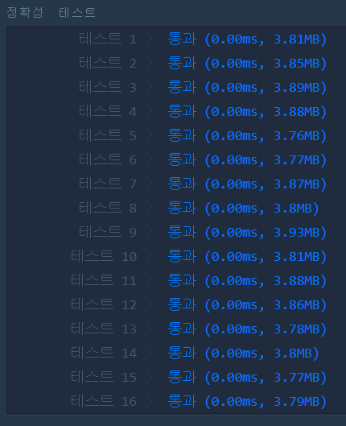

# 두 정수 사이의 합(LEVEL1)
---
## 문제
- Level1. 두 정수 사이의 합
두 정수 a, b가 주어졌을 때 a와 b 사이에 속한 모든 정수의 합을 리턴하는 함수, solution을 완성하세요.
예를 들어 a = 3, b = 5인 경우, 3 + 4 + 5 = 12이므로 12를 리턴합니다.

> 출처 https://programmers.co.kr/learn/courses/30/lessons/12912

## Solution
- 두 정수의 대소 관계를 정리한 후, 두 정수 사이의 수들의 개수를 구합니다.
- 개수가 짝수 일 경우, ```(두 정수의 합) * (개수/2) ```
- 개수가 홀수 일 경우, ```((두 정수의 합 ) * (개수-1/2)) + ((두 정수의 합)/2)```
> (long long) 타입변환 해줘야 함 

## 정확성 테스트


## Keyword
```연습문제```
