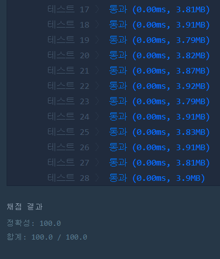

# 문자열 내 p와 y의 개수(LEVEL1)
---
## 문제
- Level1. 문자열 내 p와 y의 개수</br>
대문자와 소문자가 섞여있는 문자열 s가 주어집니다. s에 'p'의 개수와 'y'의 개수를 비교해 같으면 True, 다르면 False를 return 하는 solution를 완성하세요. 'p', 'y' 모두 하나도 없는 경우는 항상 True를 리턴합니다. 단, 개수를 비교할 때 대문자와 소문자는 구별하지 않습니다.

> 출처 https://programmers.co.kr/learn/courses/30/lessons/12916

## Solution
- p의 개수와 y의 개수를 구해 같으면 ```True```반환, 같지 않으면 ```False``` 반환합니다.

## 정확성 테스트 



## Keyword
```연습문제```
