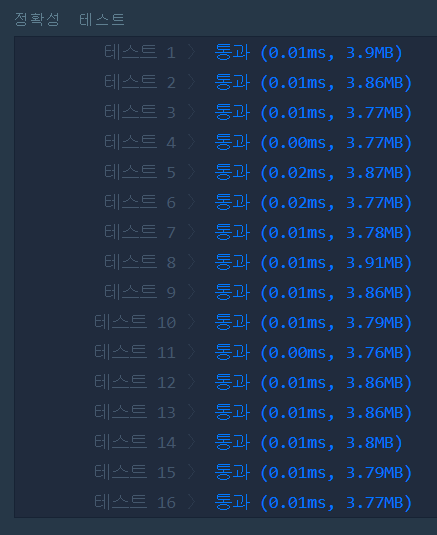

# 문자열 내림차순으로 배치하기(LEVEL1)
---
## 문제
- Level1. 문자열 내림차순으로 배치하기</br>
문자열 s에 나타나는 문자를 큰것부터 작은 순으로 정렬해 새로운 문자열을 리턴하는 함수, solution을 완성해주세요.
s는 영문 대소문자로만 구성되어 있으며, 대문자는 소문자보다 작은 것으로 간주합니다.

> 출처 https://programmers.co.kr/learn/courses/30/lessons/12917

## Solution
- STL 함수 중 ```sort```함수를 사용하여 내림차순으로 배치합니다.
- ```sort```함수는 defalut 값이 ```오름차순```이기 때문에 ```compare(사용자 정의 함수)```를 따로 만들어 ```내림차순```으로 정렬합니다.

## 정확성 테스트 


## Keyword
```연습문제```
