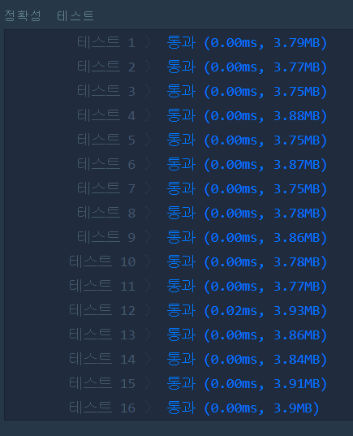

# 문자열 다루기 기본(Level1)
---
## 문제
- Level1. 문자열 다루기 기본</br>
문자열 s의 길이가 4 혹은 6이고, 숫자로만 구성돼있는지 확인해주는 함수, solution을 완성하세요. 예를 들어 s가 a234이면 False를 리턴하고 1234라면 True를 리턴하면 됩니다.

> 출처 https://programmers.co.kr/learn/courses/30/lessons/12918

## Solution
- 문자열 길이가 4개, 6개가 아닌 경우 ```false``` 출력합니다.
- 문자열이 숫자가 아닐 경우 ```false``` 출력합니다.
- 반복문이 다 돌아가면 ```true```를 출력합니다.

## 정확성테스트


## Keyword
```연습문제```
