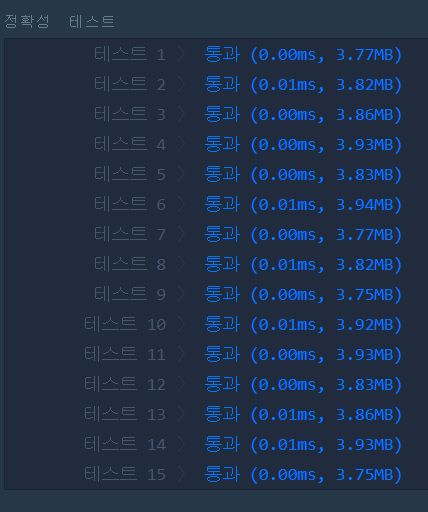

# 문자열을 정수로 바꾸기(LEVEL1)
---
## 문제
- Level1. 문자열을 정수로 바꾸기
문자열 s를 숫자로 변환한 결과를 반환하는 함수, solution을 완성하세요.

> 출처 https://programmers.co.kr/learn/courses/30/lessons/12925

## Solution
- ```stoi```함수를 사용하여 ```string```에서 ```int```로 변환합니다.

## 정확성 테스트 


## Keyword
```연습문제```
