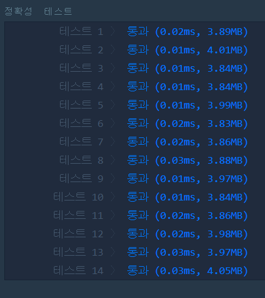

# 서울에서 김서방 찾기(LEVEL1)
---
## 문제
- Level1. 서울에서 김서방 찾기
String형 배열 seoul의 element중 Kim의 위치 x를 찾아,
김서방은 x에 있다는 String을 반환하는 함수, solution을 완성하세요.
seoul에 Kim은 오직 한 번만 나타나며 잘못된 값이 입력되는 경우는 없습니다.

> 출처 https://programmers.co.kr/learn/courses/30/lessons/12919

## Solution
- 배열의 크기만큼 반복문을 사용하여 ```Kim```과 같은 원소를 찾을 때 그 값의 인덱스를 반환합니다.

## 정확성 테스트


## Keyword
```연습문제```
