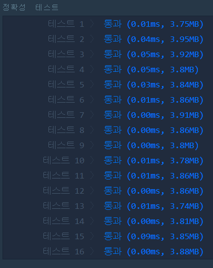

# 수박수박수박수박수박수?(LEVEL1)
---
## 문제
- Level1. 수박수박수박수박수박수?
길이가 n이고, 수박수박수박수....와 같은 패턴을 유지하는 문자열을 리턴하는 함수, solution을 완성하세요. 예를들어 n이 4이면 수박수박을 리턴하고 3이라면 수박수를 리턴하면 됩니다.

> 출처 https://programmers.co.kr/learn/courses/30/lessons/12922?language=cpp

## Solution
- 반복문을 돌려 홀수 일 경우 ```수```를 추가, 짝수 일 경우 ```박```을 추가합니다.

## 정확성테스트


## Keyword
```연습문제```
