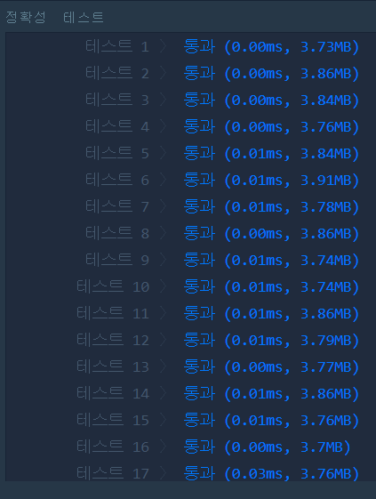

# 약수의 합(LEVEL1)
---
## 문제
- Level1. 약수의 합</br>
정수 n을 입력받아 n의 약수를 모두 더한 값을 리턴하는 함수, solution을 완성해주세요.

> 출처 https://programmers.co.kr/learn/courses/30/lessons/12928

## Solution
- 반복문을 사용하여 ```1```부터 ```N```까지 인덱스가 나누어 떨어지면 ```answer```에 값을 추가합니다.

## 정확성 테스트 


## Keyword
```연습문제```
