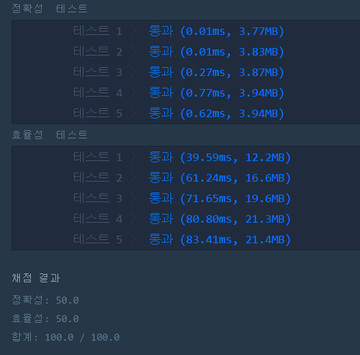

# 완주하지 못한 선수(Level1)
---
## 문제

- Level1. 완주하지 못한 선수 
수많은 마라톤 선수들이 마라톤에 참여하였습니다. 
단 한 명의 선수를 제외하고는 모든 선수가 마라톤을 완주하였습니다.
마라톤에 참여한 선수들의 이름이 담긴 배열 participant와 
완주한 선수들의 이름이 담긴 배열 completion이 주어질 때, 
완주하지 못한 선수의 이름을 return 하도록 solution 함수를 작성해주세요.
> 출처 https://programmers.co.kr/learn/courses/30/lessons/42576

## Solution

- 마라톤에 참여한 선수들의 이름이 담긴 배열을 오름차순으로 정렬합니다.
- 완주한 선수들의 이름이 담긴 배열도 오름차순으로 정렬합니다.
- participant 배열 크기만큼 반복하여 배열의 원소가 
 ```참여한 선수의 이름``` : ```완주한 선수의 이름``` 같으면 넘어가고 다를 시, answer에 값을 대입합니다. 
 - 반복문이 끝난 뒤 answer의 값이 여전히 없을 경우 participant 배열의 마지막 원소를 answer에 대입합니다. 

 ## 정확성, 효율성 테스트
 
