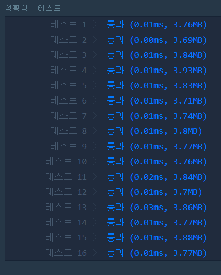

# 이상한 문자 만들기(LEVEL1)
---
## 문제
- Level1. 이상한 문자 만들기</br>
문자열 s는 한 개 이상의 단어로 구성되어 있습니다. 각 단어는 하나 이상의 공백문자로 구분되어 있습니다. 각 단어의 짝수번째 알파벳은 대문자로, 홀수번째 알파벳은 소문자로 바꾼 문자열을 리턴하는 함수, solution을 완성하세요.

> 출처 https://programmers.co.kr/learn/courses/30/lessons/12930

## Solution
- 공백기준으로 짝수 인덱스는 대문자, 홀수 인덱스는 소문자를 나타냅니다.
- 현재 인덱스가 ```공백``` 일 때 문자의 길이를 재는 ```count``` 변수가 0으로 초기화됩니다.
- 현재 ```count```변수가 짝수 일 경우 ```소문자```, ```대문자```를 구분하여 ```answer```문자열에 추가합니다. (홀수도 동일)

## 정확성 테스트 


## Keyword
```연습문제```
