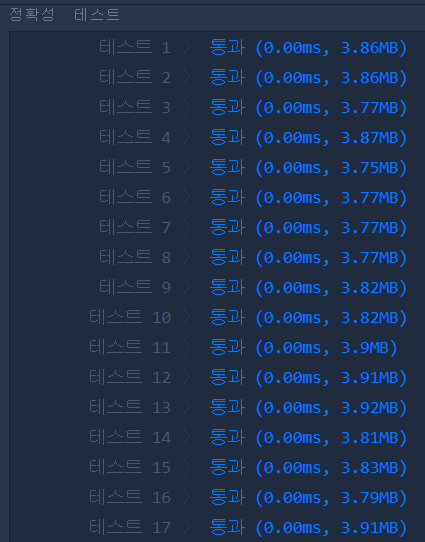
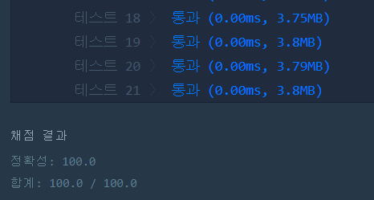

# 자릿수 더하기(LEVEL1)
---
## 문제
- Level1. 자릿수 더하기</br>
자연수 N이 주어지면, N의 각 자릿수의 합을 구해서 return 하는 solution 함수를 만들어 주세요.

> 출처 https://programmers.co.kr/learn/courses/30/lessons/12931

## Solution
- ```반복문```을 통하여 ```10```으로 나눈 나머지들의 합이 ```자릿수의 합```이니 그 값을 반환합니다.

## 정확성 테스트



## Keyword
```연습문제```
