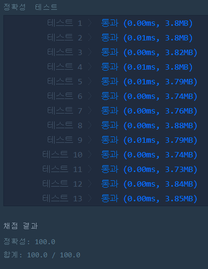

# 자연수 뒤집어 배열로 만들기(LEVEL1)
---
## 문제
- Level1. 자연수 뒤집어 배열로 만들기</br>
자연수 n을 뒤집어 각 자리 숫자를 원소로 가지는 배열 형태로 리턴해주세요. 예를들어 n이 12345이면 [5,4,3,2,1]을 리턴합니다.

> 출처 https://programmers.co.kr/learn/courses/30/lessons/12932

## Solution
- ```반복문```을 통해 ```10을 나눈 나머지```를 ```벡터```에 추가하면 뒤집어 배열로 만든 것과 같은 모양입니다.

## 정확성 테스트


## Keyword
```연습문제```
