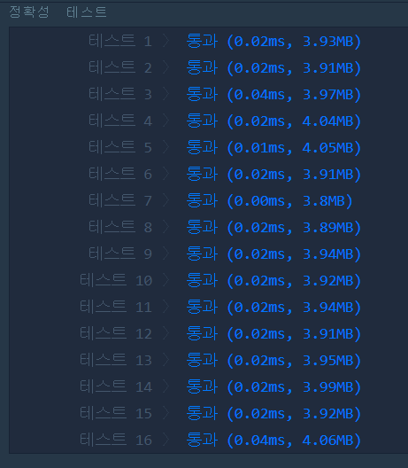

# 정수 내림차순으로 배치하기(LEVEL1)
---
## 문제
- Level1. 정수 내림차순으로 배치하기</br>
함수 solution은 정수 n을 매개변수로 입력받습니다. n의 각 자릿수를 큰것부터 작은 순으로 정렬한 새로운 정수를 리턴해주세요. 예를들어 n이 118372면 873211을 리턴하면 됩니다.

> 출처 https://programmers.co.kr/learn/courses/30/lessons/12933

## Solution
- ```long long```으로 들어오기 때문에 ```10으로 나눈 나머지```를 각각 ```벡터```에 추가합니다.
- ```벡터```를 ```오름차순```으로 정렬한 뒤, 각 벡터의 원소 값마다 ``10``을 곱해줍니다.
- 각 자릿수마다 ```10^인덱스값```와 곱해 다 더하면, 내림차순으로 배치한 값과 같습니다.

## 정확성 테스트 


## Keyword
```연습문제```
