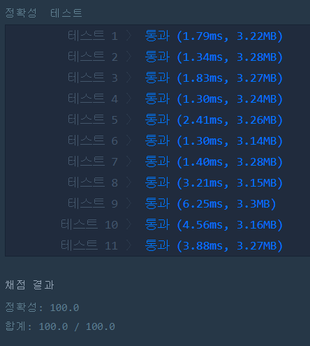

# 직사각형 별찍기(LEVEL1)
---
## 문제
- Level1. 직사각형 별찍기
이 문제에는 표준 입력으로 두 개의 정수 n과 m이 주어집니다.
별(*) 문자를 이용해 가로의 길이가 n, 세로의 길이가 m인 직사각형 형태를 출력해보세요.

> 출처 https://programmers.co.kr/learn/courses/30/lessons/12969

## Solution
- ```for```문을 사용하여 가로 n, 세로 m 만큼 ```*```을 출력합니다.

## 정확성 테스트 


## Keyword
```연습문제```
