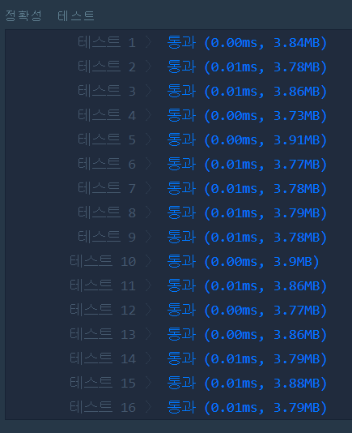

# 짝수와 홀수(LEVEL1)
---
## 문제
- Level1. 짝수와 홀수</br>
정수 num이 짝수일 경우 ```Even```을 반환하고 홀수인 경우 ```Odd```를 반환하는 함수, solution을 완성해주세요.

> 출처 https://programmers.co.kr/learn/courses/30/lessons/12937

## Solution
- ```삼항 연산자```를 사용하여 짝수, 홀수를 구분합니다.

## 정확성 테스트 


## Keyword
```연습문제```
