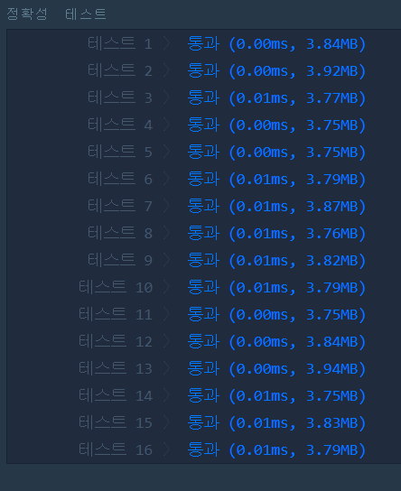

# 최대공약수와 최소공배수(LEVEL1)
---
## 문제
- Level1. 최대공약수와 최소공배수</br>
두 수를 입력받아 두 수의 최대공약수와 최소공배수를 반환하는 함수, solution을 완성해 보세요. 배열의 맨 앞에 최대공약수, 그다음 최소공배수를 넣어 반환하면 됩니다. 예를 들어 두 수 3, 12의 최대공약수는 3, 최소공배수는 12이므로 solution(3, 12)는 [3, 12]를 반환해야 합니다.

> 출처 https://programmers.co.kr/learn/courses/30/lessons/12940

## Solution
- ```유클리드 알고리즘```을 사용하여 최대공약수와 최소공배수를 구합니다.
```
- 유클리드 알고리즘
유클리드 알고리즘은 2개의 자연수의 최대공약수를 구하는 알고리즘이다. 
( 예시 )
a % b = c 일때, c가 0이면 b가 최대공약수가 된다.
c가 0이 아닐 경우
a에 b의 값을 넣어주고( a = b ), b에 c의 값을 넣어준다( b = c ).
c가 0이 될 때까지 반복한다.
```
- ```유클리드 알고리즘```을 사용하여 최대공약수를 구하였다면, 최소공배수의 공식은 ```두 수의 곱(a*b) / 최대공약수``` 입니다.
- 이때, 최소공배수를 구할 때 ```두 수(a,b)```는 처음 입력된 값입니다.

## 정확성 정확성테스트


## Keyword
```연습문제```
