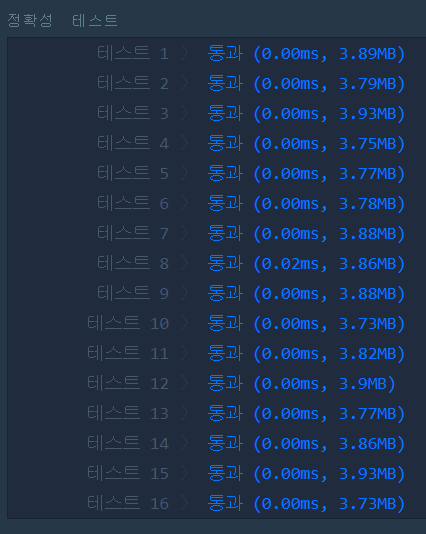

# 평균 구하기(LEVEL1)
---
## 문제
- Level1. 평균 구하기
정수를 담고 있는 배열 arr의 평균값을 return하는 함수, solution을 완성해보세요.

> 출처 https://programmers.co.kr/learn/courses/30/lessons/12944

## Solution
- ```answer```에 벡터의 원소 값을 다 더한 뒤, 벡터 ```size()``` 함수를 사용하여 값을 나누어 반환합니다.

## 정확성 테스트 


## Keyword
```연습문제```
