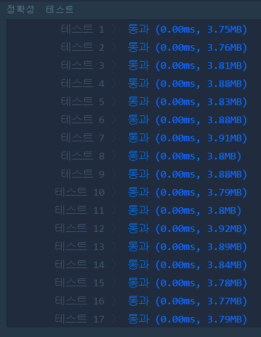

# 하샤드 수(LEVEL1)
---
## 문제
- Level1. 하샤드 수
양의 정수 x가 하샤드 수이려면 x의 자릿수의 합으로 x가 나누어져야 합니다. 예를 들어 18의 자릿수 합은 1+8=9이고, 18은 9로 나누어 떨어지므로 18은 하샤드 수입니다. 자연수 x를 입력받아 x가 하샤드 수인지 아닌지 검사하는 함수, solution을 완성해주세요.

> 출처 https://programmers.co.kr/learn/courses/30/lessons/12947

## Solution
- ```10으로 나눈 나머지들의 합```이 각 ```자릿수의 합```과 같은 역할이므로 x를 ```나머지들의 합```으로 나누어 떨어지면 ```True```를 반환합니다. 

## 정확성 테스트 


## Keyword
```연습문제```
